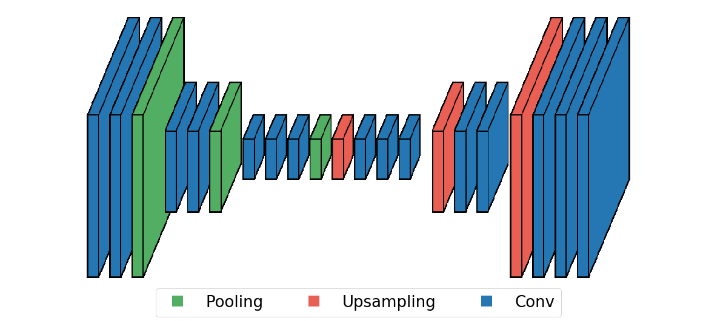

# Nets
It is an easy-to-use framework for drawing you favorite network's architecture.
It is inspired by the juicy schemas from [SegNet](http://mi.eng.cam.ac.uk/projects/segnet/)

## Usage
The API is close to this of [Keras](https://keras.io/getting-started/sequential-model-guide/)

You don't have to think about filter size, strides and activation function. It is all about shapes, colors and fonts.

```python
from nets.PlaneLayer import *
from nets.neural_net import NN

nn = NN()

# Encoder
nn.add(Conv2D())
nn.add(Conv2D())
nn.add(Pooling(pool_size=2))

nn.add(Conv2D())
nn.add(Conv2D())
nn.add(Pooling(pool_size=2))

nn.add(Conv2D())
nn.add(Conv2D())
nn.add(Conv2D())
nn.add(Pooling(pool_size=2))

# Decoder
nn.add(Upsampling(factor=2))
nn.add(Conv2D())
nn.add(Conv2D())
nn.add(Conv2D())

nn.add(Upsampling(factor=2))
nn.add(Conv2D())
nn.add(Conv2D())

nn.add(Upsampling(factor=2))
nn.add(Conv2D())
nn.add(Conv2D())

nn.add(Conv2D())
```

To draw the net, the architecture should be processed

```python
nn.compile()
nn.add_legend(bbox_to_anchor=(0.2, -0.1, 0.6, 0.1), fontsize=26)
nn.draw()
```

Pretty simple. That's it


